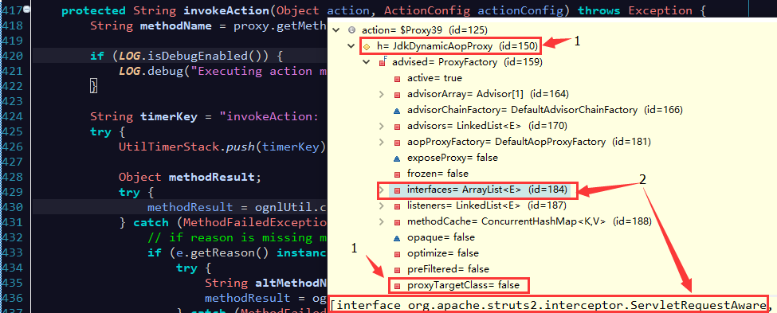
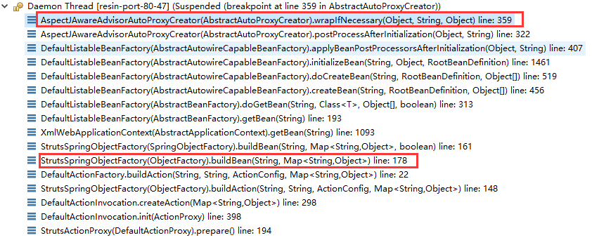
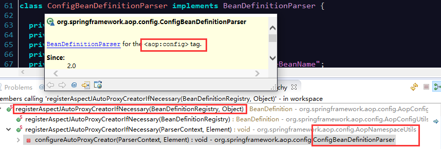
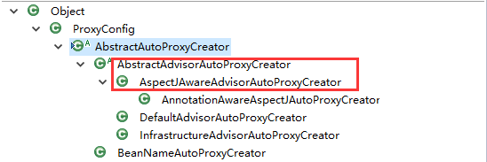

　　好久没写博客啦，一晃竟已有5个月了，实在是惭愧的很，待整理的checklist还是挺多的，努力一一补上！今天这篇博文源于工作中的一个case：为Struts2中的特定action添加监控日志。对Struts2熟悉的童鞋可能会说，这个不就是常规的aop功能吗，直接利用其自带的拦截器（Interceptor）机制就可轻易实现，so easy！但最终笔者并没有这么干，为何呢？后面会说。这期间，笔者也走了好几条弯路，皆以失败告终，其中牵涉到aop代理的好一些细节知识点，以及一些常见的aop误区，如果没有这些弯路的尝试，可能都不会注意到它，故记录于此，引以为鉴。

<!--more-->

# 问题背景

　　最近拿到一个需求：对指定的部分请求增加日志监控，即在方法调用前，做一些统一的业务逻辑判断，对于符合条件的则打印方法名、参数等上下文信息，便于后续统计分析。由于历史原因，当前工程较老，其MVC框架还是基于Struts2的！当然，由于忍受不了Struts2的各种安全漏洞、笨重不堪等问题，该工程的MVC框架也正在向spring MVC迁移。目前的情况是，Struts2和spring MVC并存，而此次所要拦截的请求都属于老的接口，问题就变成如何为Struts2中的action增加日志监控。

# 解决方案

## 一、初体验

　　背景中已提到，项目的MVC框架最终会去掉Struts2并完全切换到spring MVC，因此，**为了避免与Struts2过渡耦合**，一开始我就避开了其自带的Interceptor机制，试图用spring aop来解决它，这样就跟MVC框架无关了，后面即便切换到spring MVC，这块也不用再改动。

　　首先想到了spring中的自动代理创建器，为了与现有的代码保持一致，选用了基于Bean名称匹配的BeanNameAutoProxyCreator，为了讲解的方便，笔者写了个简单的[demo](https://github.com/sherlockyb/blog-demos/tree/master/struts2)，相关类定义如下：

```java
/**
 * @author sherlockyb
 * @2017年12月9日
 */
public class HelloAction extends ActionSupport implements ServletRequestAware, ServletResponseAware {
  ......
  public void helloA() {
    System.out.println("say: hello A");
  }
  public void helloB() {
    System.out.println("say: hello B");
  }
  public void helloC() {
    System.out.println("say: hello C");
  }
  ......
}
```

```java
/**
 * @author sherlockyb
 * @2017年12月10日
 */
public class GreetingMethodInterceptor implements MethodInterceptor {
  private final Logger log = LoggerFactory.getLogger(getClass());
  @Override
  public Object invoke(MethodInvocation invocation) throws Throwable {
    log.info("greeting before invocation...");
    Object result = invocation.proceed();
    log.info("greeting after invocation");
	return result;
  }
}
```

　　数据库的声明式事务配置`appContext-struts2-db.xml`如下，之所以要把这个配置专门列出来，因为它与后面的一次报错息息相关，我们暂且往下走。

```xml
<bean id="txAdvice" class="org.sherlockyb.blogdemos.struts2.aop.TransactionManagerAdvice"></bean>
<aop:config>
  <aop:pointcut id="helloPointcut" expression="execution(* org.sherlockyb..*HelloService*.*(..))" />
  <aop:advisor advice-ref="txAdvice" pointcut-ref="helloPointcut" order="1" />
</aop:config>
```

　　现在需要对`helloA`和`helloB`加日志监控，配置如下：

```xml
<bean name="greetingInterceptor" class="org.sherlockyb.blogdemos.struts2.aop.GreetingMethodInterceptor" />
<bean class="org.springframework.aop.framework.autoproxy.BeanNameAutoProxyCreator">
  <property name="beanNames">
    <list>
      <value>helloAction</value>
    </list>
  </property>
  <property name="interceptorNames">
    <list>
      <value>greetingAdvisor</value>
    </list>
  </property>
</bean>
<bean id="greetingAdvisor" class="org.springframework.aop.support.RegexpMethodPointcutAdvisor">
  <property name="advice">
    <ref bean="greetingInterceptor" />
  </property>
  <property name="patterns">
    <list>
      <value>org.sherlockyb.blogdemos.struts2.web.action.HelloAction.helloA</value>
      <value>org.sherlockyb.blogdemos.struts2.web.action.HelloAction.helloB</value>
    </list>
  </property>
</bean>
```

　　然后用[postman](https://www.getpostman.com/)测试action请求`http://localhost/hello/helloA.action`，直接报错：

```java
java.lang.NoSuchMethodException: com.sun.proxy.$Proxy39.helloA()
	at ognl.OgnlRuntime.callAppropriateMethod(OgnlRuntime.java:1247)
	at ognl.ObjectMethodAccessor.callMethod(ObjectMethodAccessor.java:68)
	at com.opensymphony.xwork2.ognl.accessor.XWorkMethodAccessor.callMethodWithDebugInfo(XWorkMethodAccessor.java:117)
	at com.opensymphony.xwork2.ognl.accessor.XWorkMethodAccessor.callMethod(XWorkMethodAccessor.java:108)
	at ognl.OgnlRuntime.callMethod(OgnlRuntime.java:1370)
	at ognl.ASTMethod.getValueBody(ASTMethod.java:91)
	at ognl.SimpleNode.evaluateGetValueBody(SimpleNode.java:212)
	at ognl.SimpleNode.getValue(SimpleNode.java:258)
	at ognl.Ognl.getValue(Ognl.java:467)
	at ognl.Ognl.getValue(Ognl.java:431)
	at com.opensymphony.xwork2.ognl.OgnlUtil$3.execute(OgnlUtil.java:352)
	at com.opensymphony.xwork2.ognl.OgnlUtil.compileAndExecuteMethod(OgnlUtil.java:404)
	at com.opensymphony.xwork2.ognl.OgnlUtil.callMethod(OgnlUtil.java:350)
	at com.opensymphony.xwork2.DefaultActionInvocation.invokeAction(DefaultActionInvocation.java:430)
	at com.opensymphony.xwork2.DefaultActionInvocation.invokeActionOnly(DefaultActionInvocation.java:290)
	at com.opensymphony.xwork2.DefaultActionInvocation.invoke(DefaultActionInvocation.java:251)
  ...
```

　　NoSuchMethodException？奇了怪了，`TestAction`中明明有`helloA`方法，并且patterns配置中也加了`org.sherlockyb.blogdemos.struts2.web.action.helloA`的配置，为啥最终生成的代理类却没有这个方法呢？到底是哪里出了问题？带着这个疑问，我们直接从异常信息着手：既然它报的是`$Proxy39`这个类没有`helloA`方法，那我们就来debug看一下`$Proxy39`究竟有哪些内容。

　　因为`OgnlRuntime`粒度太细了，太多地方调用，若在这里面打断点还得根据条件断点才能定位到TestAction的调用，比较麻烦，故笔者选择了在调用栈中所处位置较为上层的`DefaultActionInvocation`。定位到异常信息`DefaultActionInvocation.invokeAction(DefaultActionInvocation.java:430)`对应的源码，断点打在了源码的第430行，如下：


然后debug模式运行应用，截获的debug信息如下：



　　从1处可以看出，原来`$Proxy39`是JDK动态代理生成的代理类，至于为啥是JDK代理，可以注意到变量**proxyTargetClass**默认是**false**的，也就是说spring aop 默认采用JDK动态代理。我们知道，JDK动态代理是面向接口的，只会为目标类所实现的接口生成代理方法，查看2处`interface`的内容如下：

```java
[interface org.apache.struts2.interceptor.ServletRequestAware, interface org.apache.struts2.interceptor.ServletResponseAware, interface com.opensymphony.xwork2.Action, interface com.opensymphony.xwork2.Validateable, interface com.opensymphony.xwork2.ValidationAware, interface com.opensymphony.xwork2.TextProvider, interface com.opensymphony.xwork2.LocaleProvider, interface java.io.Serializable]
```

这些不正是`TestAction`直接（ServletRequestAware等）或间接（Action等）实现的接口嘛，而`helloA`和`helloB`是`TestAction`自定义的方法，并不在这些接口的方法中，那么最终的代理类`$Proxy39`自然不会含有这俩方法，调用时就会报上述错误。

## 二、改进

　　我们的目的是为`TestAction`中的`helloA`和`helloB`方法进行动态代理，但它们不属于`TestAction`所实现接口中的任何一个方法，显然JDK动态代理满足不了需求，转向CGLib代理，于是将**proxyTargetClass**参数改为**true**，强制其走CGLib代理。配置如下：

```xml
<bean class="org.springframework.aop.framework.autoproxy.BeanNameAutoProxyCreator">
  ......
  <property name="proxyTargetClass">
    <value>true</value>
  </property>
  ......
</bean>
……
```

依旧用postman测试，依旧报错了：  

```java
[ERROR] 2017-12-12 23:17:49,450 [resin-port-80-48] struts2.dispatcher.DefaultDispatcherErrorHandler (CommonsLogger.java:42) -Exception occurred during processing request: Unable to instantiate Action, helloAction,  defined for 'helloA' in namespace '/hello'Error creating bean with name 'helloAction' defined in class path resource [appContext-struts2-action.xml]: Initialization of bean failed; nested exception is org.springframework.aop.framework.AopConfigException: Could not generate CGLIB subclass of class [class com.sun.proxy.$Proxy40]: Common causes of this problem include using a final class or a non-visible class; nested exception is java.lang.IllegalArgumentException: Cannot subclass final class class com.sun.proxy.$Proxy40
Unable to instantiate Action, helloAction,  defined for 'helloA' in namespace '/hello'Error creating bean with name 'helloAction' defined in class path resource [appContext-struts2-action.xml]: Initialization of bean failed; nested exception is org.springframework.aop.framework.AopConfigException: Could not generate CGLIB subclass of class [class com.sun.proxy.$Proxy40]: Common causes of this problem include using a final class or a non-visible class; nested exception is java.lang.IllegalArgumentException: Cannot subclass final class class com.sun.proxy.$Proxy40 - action - file:/D:/DevCode/workspace/blog-demos/struts2/target/classes/org/sherlockyb/blogdemos/struts2/web/action/conf/struts-hello.xml:9:61
	at com.opensymphony.xwork2.DefaultActionInvocation.createAction(DefaultActionInvocation.java:317)
	at com.opensymphony.xwork2.DefaultActionInvocation.init(DefaultActionInvocation.java:398)
	at com.opensymphony.xwork2.DefaultActionProxy.prepare(DefaultActionProxy.java:194)
	at org.apache.struts2.impl.StrutsActionProxy.prepare(StrutsActionProxy.java:63)
	at org.apache.struts2.impl.StrutsActionProxyFactory.createActionProxy(StrutsActionProxyFactory.java:37)
	at com.opensymphony.xwork2.DefaultActionProxyFactory.createActionProxy(DefaultActionProxyFactory.java:58)
	at org.apache.struts2.dispatcher.Dispatcher.serviceAction(Dispatcher.java:565)
	at org.apache.struts2.dispatcher.ng.ExecuteOperations.executeAction(ExecuteOperations.java:81)
	at org.apache.struts2.dispatcher.ng.filter.StrutsPrepareAndExecuteFilter.doFilter(StrutsPrepareAndExecuteFilter.java:99)
```

　　我们可以注意到异常栈中最底层的一条错误信息：`Cannot subclass final class class com.sun.proxy.$Proxy40`，这条错误是导致上述报错的最根本原因（root cause），其对应的调用链详情如下：

```java
Caused by: java.lang.IllegalArgumentException: Cannot subclass final class class com.sun.proxy.$Proxy40
	at net.sf.cglib.proxy.Enhancer.generateClass(Enhancer.java:446)
	at net.sf.cglib.transform.TransformingClassGenerator.generateClass(TransformingClassGenerator.java:33)
	at net.sf.cglib.core.DefaultGeneratorStrategy.generate(DefaultGeneratorStrategy.java:25)
	at net.sf.cglib.core.AbstractClassGenerator.create(AbstractClassGenerator.java:216)
	at net.sf.cglib.proxy.Enhancer.createHelper(Enhancer.java:377)
	at net.sf.cglib.proxy.Enhancer.create(Enhancer.java:285)
	at org.springframework.aop.framework.Cglib2AopProxy.getProxy(Cglib2AopProxy.java:201)
```

　　也就是说，当前面配置的`BeanNameAutoProxyCreator`尝试为目标类`com.sun.proxy.$Proxy40`生成CGLib代理时，却发现**这货是final的**！也就是说**JDK动态代理生成的代理类是final的**，你们知道这个知识点嘛？反正在此之前我是没留意过这个，知道的童鞋可举个爪，那说明你走的比我远，要继续保持这样的好奇心。我们言归正传，上述错误表明，在`BeanNameAutoProxyCreator`生效前，已经有**第三者**为`TestAction`以JDK动态代理的方式生成了代理类，导致无法再进行CGLib代理。这个第三者到底是谁呢？

　　起初我想到了Struts2的Interceptor机制，会不会是Struts2事先采用JDK动态代理的方式为`TestAction`生成了代理，以便加上各种Interceptor增强逻辑？很快，我通过debug跟踪Struts2源码否决了这个猜测：

>1、action是交给spring管理的，即`StrutsSpringObjectFactory`，我们知道action的作用域是**prototype**的，即每来一个请求，Struts2都会通过`DefaultActionFactory`来buildAction，而实际的创建则是委托给`StrutsSpringObjectFactory`来处理，也就说Struts2是拿到spring容器构建好的action之后，才做后续的Interceptor过程；
>
>2、通过仔细阅读`DefaultActionInvocation`的invoke源码可知，Struts2的Interceptor机制既不是通过JDK动态代理来实现，也没有采纳CGLib代理，而是巧用责任链和迭代等代码技巧来实现的，具体细节等后面单独一篇博文细说。

　　那到底是何方神圣偷偷做了这个事儿呢？**谜底尽在源码中**！通过源码来跟踪下action的创建过程：

> 1、`DefaultActionInvocation`——action的创建（每次请求必走逻辑）

```java
protected void createAction(Map<String, Object> contextMap) {
  // load action
  String timerKey = "actionCreate: " + proxy.getActionName();
  try {
    UtilTimerStack.push(timerKey);
    action = objectFactory.buildAction(proxy.getActionName(), proxy.getNamespace(), proxy.getConfig(), contextMap);
  } catch (InstantiationException e) {
    throw new XWorkException("Unable to intantiate Action!", e, proxy.getConfig());
  }
  ......
}
```

> 2、`StrutsSpringObjectFactory`——spring容器层面的，bean的创建

```java
@Override
public Object buildBean(String beanName, Map<String, Object> extraContext, boolean injectInternal) throws Exception {
  Object o;
  if (appContext.containsBean(beanName)) {
    o = appContext.getBean(beanName);	//action从spring容器中获取
  } else {
    Class beanClazz = getClassInstance(beanName);
    o = buildBean(beanClazz, extraContext);
  }
  if (injectInternal) {
    injectInternalBeans(o);
  }
  return o;
}
```

> 3、`AbstractAutowireCapableBeanFactory`——spring容器中，bean的初始化以及之后的postProcess过程

```java
protected Object initializeBean(final String beanName, final Object bean, RootBeanDefinition mbd) {
  ......
  if (mbd == null || !mbd.isSynthetic()) {
    wrappedBean = applyBeanPostProcessorsBeforeInitialization(wrappedBean, beanName);
  }
  try {
    invokeInitMethods(beanName, wrappedBean, mbd);
  }
  catch (Throwable ex) {
    throw new BeanCreationException((mbd != null ? mbd.getResourceDescription() : null),
					beanName, "Invocation of init method failed", ex);
  }
  //Bean初始化之后，postProcess处理，如一系列的AutoProxyCreator
  if (mbd == null || !mbd.isSynthetic()) { 
    wrappedBean = applyBeanPostProcessorsAfterInitialization(wrappedBean, beanName);
  }
  return wrappedBean;
}
```

　　最终定位到`AspectJAwareAdvisorAutoProxyCreator`，直接看debug调用栈：

　　首先，我们先看下`wrapIfNecessary`的核心代码片段如下，其大致功能就是为目标bean创建代理类：先看下bean有没有相关的advice，如果有，则通过createProxy为其创建代理类；否则直接返回原始bean！

```java
protected Object wrapIfNecessary(Object bean, String beanName, Object cacheKey) {
		......
		// Create proxy if we have advice.
		Object[] specificInterceptors = getAdvicesAndAdvisorsForBean(bean.getClass(), beanName, null);
		if (specificInterceptors != DO_NOT_PROXY) {
			this.advisedBeans.add(cacheKey);
			Object proxy = createProxy(bean.getClass(), beanName, specificInterceptors, new SingletonTargetSource(bean));
			this.proxyTypes.put(cacheKey, proxy.getClass());
			return proxy;
		}
		this.nonAdvisedBeans.add(cacheKey);
		return bean;
	}
```

这里bean的debug信息如下：

`HelloAction@3d696299`，这正是我们在xml中定义的原始bean实例！也就说，`AspectJAwareAdvisorAutoProxyCreator`就是传说中的第三者。那么问题来了：`AspectJAwareAdvisorAutoProxyCreator`是在什么情况下又是何时被创建的呢？我们并没有显式地在哪里指定，要让它为`HelloAction`创建代理，这二者是如何关联的起来的呢？

　　在eclipse中，定位到`AspectJAwareAdvisorAutoProxyCreator`类的源码，选中其类名，直接`Ctrl+Shift+G`查看其在workspace中的所有引用（reference）如下：

　　进一步跟进`registerAspectJAutoProxyCreatorIfNecessary`方法，直接`Ctrl+Shift+H`查看该方法的上层调用链：

　　到这里第一个问题就比较清晰了：由于`appContext-struts2-db.xml`中通过`<aop:config>`为数据库操作配置了声明式事务，导致`AspectJAwareAdvisorAutoProxyCreator`实例的构建。我们再来看第二个问题，即这个AutoProxyCreator是如何与HelloAction关联的，回顾下前面的`wrapIfNecessary`的源码片段，其中有一个`getAdvicesAndAdvisorsForBean`方法，它是定义在抽象类AbstractAutoProxyCreator中的抽象方法，其功能如下方的官方注释所说：判断当前目标bean是否需要代理，如果是则返回对应的增强（advice）或切面（advisor）集。具体实现则交给各具体的子类，典型的模板方法设计。

```java
/**
  * Return whether the given bean is to be proxied, what additional
  * advices (e.g. AOP Alliance interceptors) and advisors to apply.
  */
  protected abstract Object[] getAdvicesAndAdvisorsForBean(Class<?> beanClass, String beanName, TargetSource customTargetSource) throws BeansException;
```

`AbstractAutoProxyCreator`类的继承结构如下：



其中的`AbstractAdvisorAutoProxyCreator`很关键，它是第三者`AspectJAwareAdvisorAutoProxyCreator`的直接父类，并实现抽象方法`getAdvicesAndAdvisorsForBean`，逻辑如下：

```java
@Override
protected Object[] getAdvicesAndAdvisorsForBean(Class beanClass, String beanName, TargetSource targetSource) {
	List advisors = findEligibleAdvisors(beanClass, beanName);	//找出bean相关的advisors
	if (advisors.isEmpty()) {
      return DO_NOT_PROXY;	//如果没有advisor，则直接返回约定的DO_NOT_PROXY，表示无需代理
	}
	return advisors.toArray();
}
```

再看下`findEligibleAdvisors`具体做了什么：

```java
protected List<Advisor> findEligibleAdvisors(Class beanClass, String beanName) {
  //获取当前spring容器中所有的Advisor，除了FactoryBean类型的和目前已构建过的
  List<Advisor> candidateAdvisors = findCandidateAdvisors();
  List<Advisor> eligibleAdvisors = findAdvisorsThatCanApply(candidateAdvisors, beanClass, beanName);	//从中筛选出可以应用在bean上的advisor
  extendAdvisors(eligibleAdvisors);
  if (!eligibleAdvisors.isEmpty()) {
    eligibleAdvisors = sortAdvisors(eligibleAdvisors);
  }
  return eligibleAdvisors;
}
```

最终通过层层代码跳转，我们来到了`AopUtils`中判定advisor与bean是否匹配的关键逻辑：

```java
public static boolean canApply(Pointcut pc, Class<?> targetClass, boolean hasIntroductions) {
  if (!pc.getClassFilter().matches(targetClass)) {	//先看类级别是否匹配，不匹配就直接返回false
    return false;
  }
  //方法匹配器：切点的一部分，判定目标方法是否与切点表达式匹配
  MethodMatcher methodMatcher = pc.getMethodMatcher();
  IntroductionAwareMethodMatcher introductionAwareMethodMatcher = null;
  if (methodMatcher instanceof IntroductionAwareMethodMatcher) {
    introductionAwareMethodMatcher = (IntroductionAwareMethodMatcher) methodMatcher;
  }
  Set<Class> classes = new HashSet<Class>(ClassUtils.getAllInterfacesForClassAsSet(targetClass));
  classes.add(targetClass);
  /**这里的classes由两部分组成：一个是目标类所实现的所有接口；一个是目标类本身(targetClass)。结合下面的循环扫描Methods的逻辑，也就是说，它会扫描目标类所实现的所有接口中定义的方法和目标类自身定义的方法
  */
  for (Class<?> clazz : classes) {
    Method[] methods = clazz.getMethods();
    for (Method method : methods) {
      if ((introductionAwareMethodMatcher != null && 
           introductionAwareMethodMatcher.matches(method, targetClass, hasIntroductions)) ||
           methodMatcher.matches(method, targetClass)) {
        return true;
      }
    }
  }
  return false;
}
```

　　看到这儿整个流程就清晰了：由于我们配置了`greetingAdvisor`，并且`patterns`与`HelloAction`中的`helloA`和`helloB`匹配，导致相应的`advisor`与目标bean（HelloAction）关联了，即`getAdvicesAndAdvisorsForBean`返回的`Interceptors`不为`DO_NOT_PROXY`，于是走了下面的`createProxy`逻辑，又因为`AspectJAwareAdvisorAutoProxyCreator`的配置项`proxyTargetClass`默认是false的，进而为`HelloAction`创建了JDK动态代理。

## 三、最终版

　　经过上述两次错误分析，我们得知以下几点：

> 1、首先使用CGLib的方式为`HelloAction`创建代理是必须的，因为我们所要代理的方法是`HelloAction`自定义的，且不在其所实现接口的方法列表中，面向接口的JDK动态代理行不通；
>
> 2、只要当前应用中别的地方事先配置了`<aop:config>`（比如最常用的声明式事务），就无法使用`BeanNameAutoProxyCreator`的方式为`HelloAction`创建CGLib代理！因为要为目标类的部分方法生成代理，其配置项`interceptorNames`就只能用`Advisor`而非普通的bean名称，而`Advisor`又会被`AspectJAwareAdvisorAutoProxyCreator`扫描到，最终导致上述二次代理的问题。

　　最终去掉了`BeanNameAutoProxyCreator`和`greetingAdvisor`，改为`<aop:config>`通过指定`proxy-target-class`为true强制`AspectJAwareAdvisorAutoProxyCreator`走CGLib代理，配置如下：

```xml
<aop:config proxy-target-class="true"> <aop:pointcut id="pt-greet" expression="( execution(* org.sherlockyb.blogdemos.struts2.web.action.HelloAction.helloA(..)) or execution(* org.sherlockyb.blogdemos.struts2.web.action.HelloAction.helloB(..)) )"/>
  <aop:advisor id="ad-greet" advice-ref="greetingInterceptor" pointcut-ref="pt-greet"/> 
</aop:config>
```

　　最后的拦截效果如下：

```java
[INFO] 2017-12-14 23:44:03,972 [resin-port-80-51] struts2.aop.GreetingMethodInterceptor (GreetingMethodInterceptor.java:33) -greeting before invocation...
say: hello A
[INFO] 2017-12-14 23:44:08,234 [resin-port-80-51] struts2.aop.GreetingMethodInterceptor (GreetingMethodInterceptor.java:35) -greeting after invocation
```

# 总结

## 一、JDK与CGLib动态代理的本质区别

### 1.1 JDK动态代理
　　**JDK动态代理是面向接口**的，即被代理的目标类必须实现接口，且最终只会为目标类所实现的所有接口中的方法生成代理方法，对于目标类中包含的但是非接口中的方法，是不会生成对应的代理方法，methodA和methodB就是例子，这是由JDK代理的实现机制所决定了的：通过继承自Proxy类，实现目标类所实现的接口来生成代理类。

　　JDK动态代理生成的代理类，以$Proxy开头，后面的计数数字表示当前生成的是第几个代理类。且**代理类是final的**，不可被继承。
### 1.2 CGLib动态代理
　　而CGLib则是通过继承目标类，得到其子类的方式生成代理，而final类是不能被继承的，因为CGLib无法为final类生成代理。

　　CGLib代理生成的代理类含有`$$`，比如`HelloAction$$EnhancerByCGLIB$$ff7d443b`。

## 二、对aop的不熟练所引发的问题

　　对aop的不熟练，使得我们在用的时候，往往就容易忽视了一些细节，如当前采用的动态代理是JDK的还是CGLib的，默认选择是什么？都有哪些配置项，配置项的默认值，以及各配置项对最终生成代理结果的影响如何？当前类是否被多次代理？当出现了多次代理，代理的顺序又是如何？

　　对于第二次报错，其本质问题是属于**二次代理**的问题。有网友也遇到过类似的问题——[记一次Spring的aop代理Mybatis的DAO所遇到的问题](http://www.cnblogs.com/study-everyday/p/7429298.html)，只不过是在MyBatis上踩的坑，后续将会针对spring aop单独另开博文详解，尽情期待~

## 三、Struts2的Interceptor机制原理

　　Struts2的Interceptor机制是属于aop功能，按理说用常规的动态代理就可实现。但是由[初体验](#一、初体验) 小节中debug过程可知，它并没有基于常规的动态字节码技术如JDK动态代理、CGLib动态代理等，而是通过责任链模式和迭代的巧妙结合，实现了aop的功能，有兴趣的话也可研究一下。